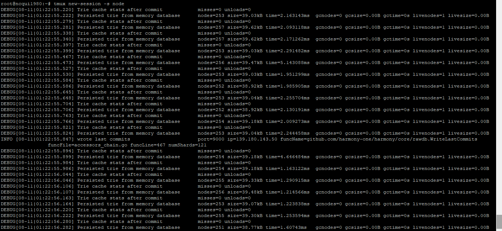
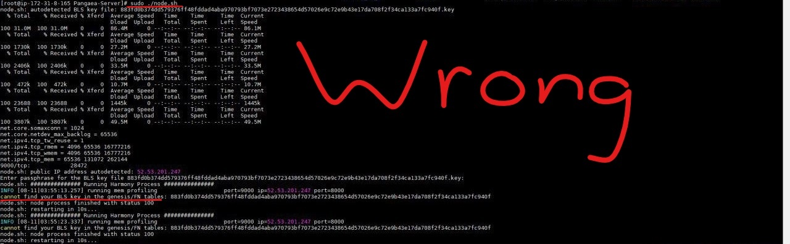
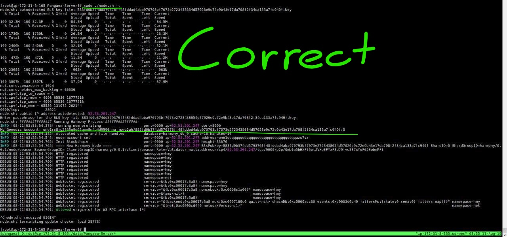

# Frequently Asked Questions

## How long does it take for the Harmony node to sync?

It takes around 1-2 hours for the node to sync. _Trie cache commit...Persisted trie from memory database_ is a valid output and typically signifies that you are syncing to blockchain. Once you are synced, you should be seeing BINGO!! messages.

## How do I check for Bingos in logs?

Run the command in tmux: `tac latest/zero*.log | grep -am 1 "BINGO"`

## Am I part of consensus? \(Have I synced\)

The more blocks in a blockchain the more content you need to download in order for your node to be up to date with the blockchain. When you are syncing you are downloading all the preexisting blocks. To know if you have finished syncing use the command above to check for Bingos. A bingo means that consensus has been reached on a new block.

## Is my node still running when I close my terminal instance?

If you hit **ctrl b + d** you DETACH from tmux and your node will continue running/syncing.

## Genesis.go cannot find the key

You are trying to access mainnet: `sudo ./node.sh -t` attaches to testnet/Pangaea \(`sudo ./node.sh` connects you to MAINNET\)

## Can I run One-Click Deploy on Windows?

At the moment we do not support running One-Click Deploy on Windows. You can use Windows with our [regular setup](https://app.gitbook.com/@harmony-one/s/pangaea/~/edit/drafts/-LlyAL0C_3zYBtyjRnkp/setup-your-node-and-connect-to-pangaea/node-setup/advanced-users/aws).

