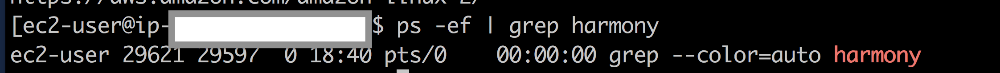

# Restart Guide

## Killing the Node and Cleaning the Database

### Killing the Current Node

Attach to your tmux session.

```text
tmux attach -t node
```

\[If you don't have `tmux` session running, follow instructions [here](https://docs.harmony.one/pangaea/troubleshooting/how-to-restart-your-node/troubleshooting#how-to-kill-node-process-from-outside-of-tmux) to kill current node process. \]

Once you are attached, kill the node process:

```text
<Ctrl> + C
```

Double check whether the node process has stopped running by doing the following:

```text
ps -ef | grep harmony
```

You should see something like this:



If not, please contact the Pangaean Tech Ambassador for assistance.

### Cleaning the Database

Create more space for your new blockchain by clearing out the old blockchain and start the sync from 0:

```text
sudo rm -rf harmony_db_*
```

## Downloading the New Files and Restarting

\(If you have done this after September 21, you no longer need to do it.\)

### Updating wallet.sh

Replace your old script with the **updated** wallet script from our Github.

```text
curl -LO https://raw.githubusercontent.com/harmony-one/harmony/pangaea/scripts/wallet.sh
```

Change the permission of the script:

```text
chmod u+x wallet.sh
```

Download the wallet binary \(note that the -t MUST go before the -d\):

```text
./wallet.sh -t -d
```

For screenshots and more instructions, [visit this page](https://docs.harmony.one/pangaea/setup-your-node-and-connect-to-pangaea/node-setup/last-steps-1#downloading-the-wallet).

### Updating node.sh

Replace your old script with the **updated** node script from our Github.

```text
curl -LO https://raw.githubusercontent.com/harmony-one/harmony/pangaea/scripts/node.sh
```

Change the permission of the script:

```text
chmod u+x node.sh
```

Lastly, launch node.sh, without -c flag.

```text
sudo ./node.sh -t
```


The `-c` option backups the old blockchain, and **should only be done when the entire network is being restarted**. Unless we specifically say to do so after a network reset, it **should not be used**. Since the blockchain has been deleted above, it is not required to start with -c


```text
sudo ./node.sh -t -c
```

Additionally, for more information with this network reset, last steps have now been updated.

**Note: MANY of the log messages have changed. Commands you are used to using may very well no longer work. Please check this page for the most updated information.**



