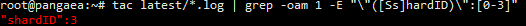
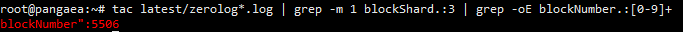
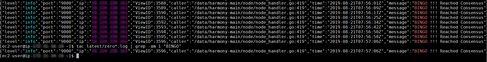
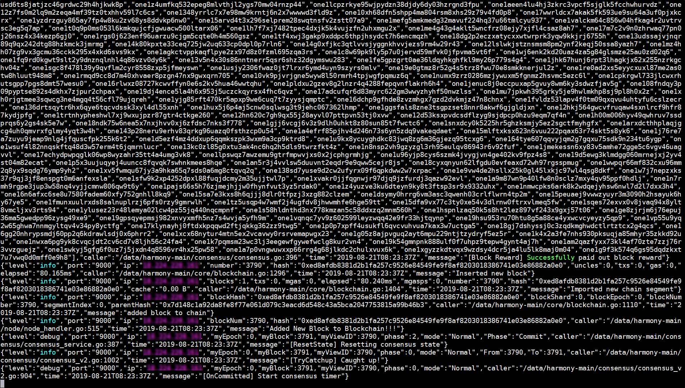
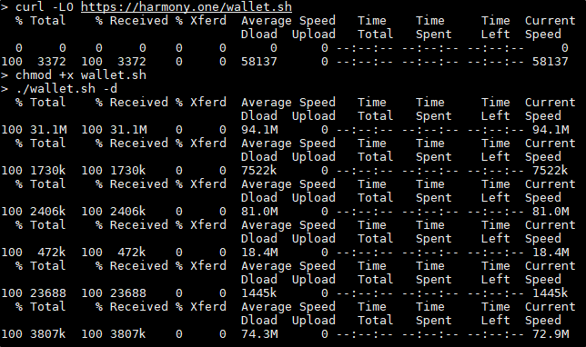
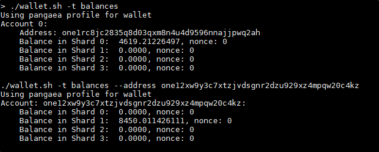

# Last Steps

**If you have made it this far, you belong to a tiny group of people on this planet who know how to run a block chain node. Congratulations!!**

Here are some final checklist items to make sure your node is up and running. You can come back to these steps whenever you would like to check the status of your node.

## Node Monitoring

### Block Syncing

**In the latest Pangaea version, none of the shards will have any output logs in tmux window. They can only be seen now through the command :**

```text
tail -f latest/zero*.log
```

When you first join the network, your node will need to catch up to the latest block. This will take some time, depending the current blockchain size and also depending on your instance. When the block is syncing it will repeat the message:

```text
Checking your Block Number and Shard
```

Now that you know that you're syncing, you most likely want to check how many blocks you've downloaded.

#### Block Shard

To get your block shard, you can run this command:

```text
tac latest/*.log | grep -oam 1 -E "\"([Ss]hardID)\":[0-3]"
```

This command will check your logs and search for any occurrence of "shardID".  
The time that the pattern appeared does not matter as block shard is unable to change at the moment.



#### Block Number

With the recent updates, you need now to insert **yourshardID** \(ie 0, 1, 2 or 3\) to get the most accurate number, you can run this command:

```text
tac latest/zerolog*.log | grep -m 1 blockShard.:<yourshardID> | grep -oE blockNumber.:[0-9]+
```

Below is an example with shard 3:



However, block shard/number isn't particularly useful without a reference point.  
In order to find the current block numbers for a shard, you can check [the Pangaea network status page](https://harmony.one/pga/network).  
This also has the shard statuses so you can be sure to know whether it's your problem or ours!  
\(Now also comes in [CSV ](https://harmony.one/pga/network.csv)and [JSON ](https://harmony.one/pga/network.json)format!\)

### Bingo Messages

Once you're completely synced up, you should begin to get messages like `"BINGO !!! Reached Consensus"` in your zerolog file.  
To check these messages either of the following commands can be used:

#### For the latest occurrence of BINGO:

```text
tac latest/zero*.log | grep -am 1 "BINGO"
```

#### For all occurrences of BINGO:

```text
grep -a "BINGO" latest/zero*.log
```



In most situations, the latest occurrence of bingo is all that is needed.  
This is because the message also carries a timestamp, which can be used to diagnose problems.

### Zerolog Output

If you want to know more about the raw output of your node, you can read the contents of the zerolog.  
The zerolog is where almost all of the messages that the node prints out is written to.  
It is located in the "latest" folder, and is what we query to find the important information as seen above.  
If you would like to see what outputs as your node runs, this command will do the trick:

```text
tail -f latest/zero*.log
```

As new lines are printed to the file, this command will output the lines as they appear.  
NOTE: This will continue until you close it. You can do so by pressing **`Ctrl + C`**!



## Balance Checking

### Downloading the Wallet

**If you are checking this page after September 21, 2019, you will need to update the wallet software.**

In order to check your balances you need to have the wallet script downloaded. This can be done by running the following two commands to download and change permissions on the script.

```text
curl -LO https://raw.githubusercontent.com/harmony-one/harmony/pangaea/scripts/wallet.sh
chmod +x wallet.sh
./wallet.sh -t -d
```



### Using the Wallet

Once the wallet files are downloaded, you can now enter the following to check your balance.

```text
./wallet.sh -t balances
```

You can also specify a specific address to see it as well.

```text
./wallet.sh -t balances --address <WALLETID>
```



### Balance Pages

One additional way to check balances without accessing your node is with the Pangaea balance pages.  
These pages update every 15 minutes, checking in the intervals of the past 1 hour, 4 hours, and 24 hours.  
You can also check your total balance by using the "balances" URL.

Additionally, these pages check if balance has changed in the past 15 minutes, and labels nodes as earning or not earning.  
Note that in order to use the pages, you will also need your "one" address, found using wallet.sh.  
Lastly, for those developers out there, there are also other raw formats that can be queried as well.  
Without further ado, these are the pages:

**General Pages**  
1 hour: [https://harmony.one/pga/1h](https://harmony.one/pga/1h)  
4 hours: [https://harmony.one/pga/4h](https://harmony.one/pga/4h)  
24 hours: [https://harmony.one/pga/24h](https://harmony.one/pga/24h)  
Total balance: [https://harmony.one/pga/balances](https://harmony.one/pga/balances)

**For Devs:**  
All pages have a CSV version and a JSON version.  
These can be accessed with the added extension of ".csv" or ".json".  
Examples: [https://harmony.one/pga/1h.csv](https://harmony.one/pga/1h.csv) or [https://harmony.one/pga/balances.json](https://harmony.one/pga/balances.json)

## Join Community Channels

Make sure to join our community channels to talk and interact with other Pangaeans!

Discord - [https://discord.gg/eJv6wq3](https://discord.gg/eJv6wq3)

Telegram - [https://t.me/harmonypangaea](https://t.me/harmonypangaea)

We hope you have a seamless and fun time here on our new continent. See you on our network!

