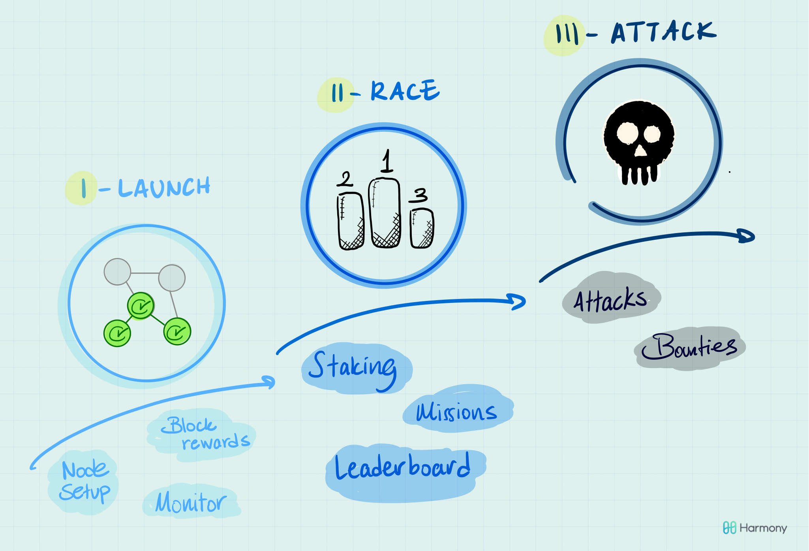

# Original Pangaea intro

## The 3 phases of Pangaea

Each phase of Pangaea serves a different purpose. Our goal is to create a natural transition from setting up your node to achieving stability, and then to start competing in various challenges to strengthen the Pangaea network.

### Phase I \(Aug 15th — 29th\) ~14 days

The launch phase. The main purpose is to get hundreds of nodes to successfully join Pangaea. We understand that ‘running a blockchain node’ does not come naturally to everyone; so our team will help you with the set up, answer your questions, and bug you with ‘surprise quizzes’ to make sure you are learning! Beware, you will be able to transfer and stake your rewards in the next phases.

Goals:

* Setup your node and join the network
* Check your balances, block rewards and redeem your daily tokens from the faucet
* Monitor the stability of your node

### Phase II \(Sep 10th - 24th\) ~14 days

In this phase, the nodes will work together to maximize performance and complete missions, such as sending transactions and using staking smart contracts.

Goals:

* Complete “missions” \(e.g., sending tokens transactions to other players\)
* Compete on key performance metrics such as uptime, block rewards and latency

### Phase III \(Tentative\)

This is where things will get messy, and more entertaining for the seasoned hacker. We want to test the limits of security and stability of our network by incentivizing evil behavior. This may come in various forms: a\) you can win prizes for breaking things and b\) you may find yourself with ‘super powers’ randomly given by Harmony, and asked to use them in an adversarial way.

Goals:

* Organize individual or group attacks
* Identify and submit security bugs

## Game rewards

We want to make sure that everyone is rewarded for the work they put into Pangaea. This means covering the basic costs of operating a node as well as additional incentives for those who go above and beyond.

