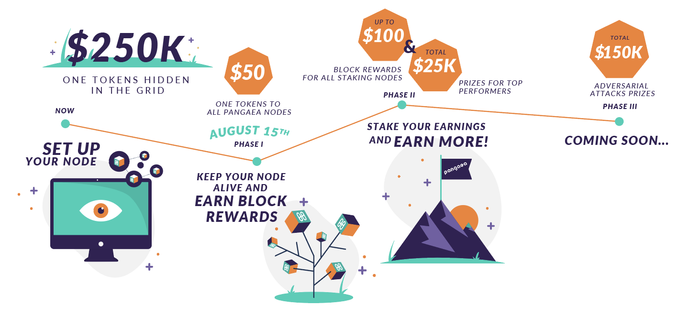

# Rewards for Phase-1

You can earn **up to $50 worth of ONE tokens** upon completing Phase-1. All rewards for Phase-1 will be distributed on **August 29th**.

## Terms

* **Everyone** who successfully set up a Pangaea node will receive **$10 worth of ONE tokens** _\(this is mainly for covering your cloud provider expenses\)_ 
* Everyone who keep their nodes up and running **from 15th Aug to 23rd Aug** will receive the additional **$40 in ONE tokens** 
* Nodes that are down for some part of the Phase-1 will receive **partial rewards** \(e.g., $20 for running for 4 days during 15th-23rd Aug\)

Don't forget to check in regularly to see if your node is up and validating blocks in order to make sure you get the full reward.

If your node is down, please try to revive it as soon as possible by asking for help in our Telegram and Discord groups. You can also e-mail us at pangaea@harmony.one. The nodes that are down and also not attempted to revive might be considered disqualified.

