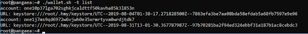

# Wallet and Token Transfers \(old version\)

## With the wallet, you can do the following:

* Create/generate account id
* Save your private key in local storage
* Check account balance
* Check transaction history \(using the block explorer\)
* Send tokens to another account id
* Send tokens between different shards \(cross shard transactions\)

**Installation**  
Download the wallet using the following script

```text
curl -LO https://raw.githubusercontent.com/harmony-one/harmony/pangaea/scripts/wallet.sh
chmod u+x wallet.sh
./wallet.sh -t -d
```

**Using the Wallet**  
Once you downloaded the wallet, you can review these detailed instructions for implementing the features:

Then you can execute it using the wallet.sh wrapper script.

```text
./wallet.sh -help
```


* The action New allows you to create a new wallet account with the private key stored locally. Let's call this account A.

```text
./wallet.sh new
```


NOTE: When creating new wallet you are prompted for a passphrase, you will not see anything while typing but rest assured that every key you hit gets recorded here. After you type in your desired passphrase you have to confirm it again, then the new wallet is created.

* The action **List** lists all the locally stored accounts.

```text
./wallet.sh list
```



* The action **Balances** shows the balances of all local accounts in each shard \(Note a single account can have separate balances in each shard\). You can check a specific address’s balance by specifying the “--address” parameter.

```text
./wallet.sh -t balances
```


* The action **getFreeToken** will talk to the faucet smart contract and request 100 Harmony Testnet tokens in each shard for the specified address by “--address” parameter.

```text
./wallet.sh -t getFreeToken 
--address=one10p37lga702sghkjcaldttf50kavha85k3l853n
```


* After the above command, checking the balance will show the new balance in each shard.

```text
./wallet.sh -t balances
```


NOTE: Since shard 1 is currently offline, no balances were added in the shard 1 of the above address. If shard 1 would be online, we would also receive 100 tokens in that shard.

* Now we create a new account, let's call it account B, to transfer some tokens from the previous wallet \(account A\).

```text
./wallet.sh new
```


* We see the balance in the new account B that we created is 0 for all shards.

```text
./wallet.sh -t balances
```


* We can transfer tokens from account A to account B by specifying the sender’s address, receiver’s address, the amount to transfer, and the shard ID.

**WALLET TRANSFERS \[ Current as of Sep 12, 2019 UTC 11:30 AM \]**  
You can transfer tokens from one wallet to another using these commands below:

```text
./wallet.sh -t transfer 
--from=one10p37lga702sghkjcaldttf50kavha85k3l853n 
--to=one1j7ms9qd6972w6vjwh0e35xrmrtyva0wrdjtdk7 
--amount=10 --shardID=2 toShardID=2 --pass pass:
```

_Note: This is under assumption that you have sufficient balance \(10 in this case\) in your Shard 2_

If you want to transfer tokens between shards use the commands in the following block:

```aspnet
./wallet.sh -t transfer 
--from=one10p37lga702sghkjcaldttf50kavha85k3l853n 
--to=one1j7ms9qd6972w6vjwh0e35xrmrtyva0wrdjtdk7 
--amount=10 --shardID=2 --toShardID=0 --pass pass:
```

\*\*\*\*

**NOTE: if you create a new wallet with a passphrase, you have to input that passphrase in the command above \(all default Pangaea/testnet wallets come without a passphrase, all other accounts you create will contain a password\).**

If we check the balances with the ./wallet.sh -t balances command we can now see that 10 tokens have been transferred from account address one10p37lga702sghkjcaldttf50kavha85k3l853n to account address one1j7ms9qd6972w6vjwh0e35xrmrtyva0wrdjtdk7 on Shard 2.

