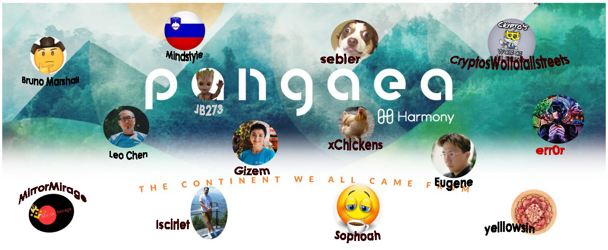

# Community

Please join Pangaea **Discord and Telegram channels** to follow the discussion.

If you cannot join Discord or Telegram for any reason, the **important updates will be shared via e-mail.**

## Telegram

Join [**Harmony - Pangaeans**](https://t.me/harmonypangaea) group on telegram. This is the general discussion channel for Pangaea discussions, questions and announcements. People use this chat daily regardless of Pangaea competitions :\)

Join [**Pangaea Announcements**](https://t.me/Pangaeaannouncements) chat for staying up to date with announcements.

## Discord

### \#Pangaea \(general discussion\)

This is the public communication channel for Pangaea, and intended for general discussions and announcements.

Please join our Discord at [\#Pangaea ](https://discord.gg/eJv6wq3)

## Infamous P-OPS team

Pangaea OPS is a ~10 people team who had volunteered to provide tech support for all Pangaeans during the early stages of Phase-1. Now they are an extended part of Harmony engineering team and responsible from maintaining Pangaea network as well as other testing work.

P-OPS team spends time with Harmony engineering team on a weekly basis to coordinate testing efforts as well as to create a solid bridge with the technical community.

### Intro by a community member  \*\*\*Pangaea Team\*\*\*

@GizemC 👩‍👧‍👦 also called "Pangaea Mother" She is in charge with our surveys received, keys and others, let's say she is the lady in charge with our rules !

@Bruno\_Marshall 🤠 "The Wise Man" He is one of the basic pillars of this game and his knowledge helped and encouraged newbies like my to never give up !

@mindstyle85 👨‍🎨 "The Artist" He is a guy from a country with "love" a guy who never sleeps and you always find him here among messages and codes !

@iscirlet 👨🏻‍💻 "The Maker" He is my compatriot a guy with knowledge who always have his bag with answers when you ask something about Harmony ecosystem !

@CryptosWolfofallstreets 🧛‍♂️ "The Wolf" He is the Wolf between wolves and another ONE like him you will never find, you can count anytime on his devotion !

@sebler 👨‍🚀 "mrBubz" He is the network breaker with his nose in scripts and loops all day looking to breake the limits of pangaea network everyday !

@Sophoah 👨‍🔧 "The Coffee Man" He is the guy who always offers you a cofee and try to answer and solve all your problems when you enjoy your coffee !

@JB273 👨‍🔬 "Groot" One of the first, the guy in charge with bandwith usage so you'll never exceed the limits and keep your funds in pockets and not waste them !

@MirrorMirage 👨‍⚕️ "The Doctor" I think he was the first coder who made a health script for Pangaea nodes so we could check the pulse of our nodes !

@yelllowsin 👷‍♂️ "The Staker" I think i have seen him very rare in messages , so i dont know to much about him but I'll greet him with this message !

@xChickens 👨‍🎓 "The Creator" I think his nickname says all about his meaning for this game !

\*\*\*They are the P-OPS Team also called "lolliP-ops" that's how i called them :D, the 💂‍♂️ guardians of Pangaea 🌎, so keep your eyes opened\*\*\*

