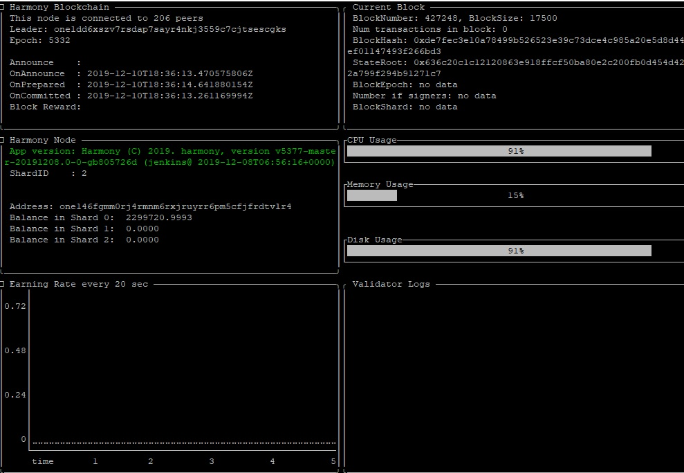

# Harmony TUI

You can download the Harmony TUI \(textual user interface\) for an easier overview of your node:

```text
curl -LO https://harmony.one/tui
chmod +x tui
```

To check your Node:

```text
LD_LIBRARY_PATH=. ./tui -address one146fgmm0rj4rmnm6rxjruyrr6pm5cfjfrdtvlr4
```

\*You need to change the wallet address in the command to your specific wallet

To close the window enter ctr+c



More information of its usage is here: [https://github.com/harmony-one/harmony-tui](https://github.com/harmony-one/harmony-tui)

