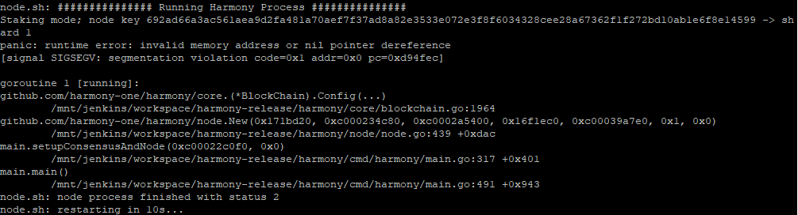

# Known Issues

1. **Cannot get Beaconchain**

if you have issues starting the node, and you see `"cannot get beaconchain"` message in your zerolog, then most probably means your beaconchain database has not been initialized correctly or has been initialized for a different chain/network.



Workaround:

```bash
sudo mv -f harmony_db_0 harmony_db_0.broken
```

And now try running node again.

1. **On Ubuntu 16.04,18.04/19.x/Debian 9, the harmony static binary might cause SIGSERV/SEGFAULT because its unable to resolve addresses.**

To resolve this , install and configure DNSMASQ as per instructions at [https://github.com/harmony-one/harmony/issues/1811\#issuecomment-555062409](https://github.com/harmony-one/harmony/issues/1811#issuecomment-555062409)

1. When creating validator , if you get the error "Error: encoding/hex: invalid byte: U+002E '.' v16838a4ef8: encoding/hex: invalid byte: U+002E '.'" , it means you specified the --bls-pub-key param with the .key, remove the **.key** and specify only the file name.
2. When creating validator, if you get the error "Error: ChainID on node differs from received chainID: current chain id:2: invalid chain id for signer v16838a4ef8: ChainID on node differs from received chainID: current chain id:2: invalid chain id for signer: , Make sure you are specifying --chain-id **testnet**. For pangaea, when running ./node.sh you specify -N **pangaea** but for ./hmy you specify --chain-id **testnet**

