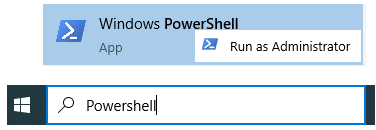

# Windows Subsystem for Linux \(WSL\) \(First Time Users\)

## Install the Windows Subsystem for Linux

Before installing any Linux distros for WSL, you must ensure that the "Windows Subsystem for Linux" optional feature is enabled:

1. Open PowerShell as Administrator :



1. and run:

Enable-WindowsOptionalFeature -Online -FeatureName Microsoft-Windows-Subsystem-Linux

1. Restart your computer when prompted.

## Install your Linux Distribution of Choice

Download and install your preferred distro\(s\)

1. Download and install from the Microsoft Store 

Open the Microsoft Store and choose your favorite Linux distribution.


The following links will open the Microsoft store page for each distribution:

* [Ubuntu 16.04 LTS](https://www.microsoft.com/store/apps/9pjn388hp8c9)
* [Ubuntu 18.04 LTS](https://www.microsoft.com/store/apps/9N9TNGVNDL3Q)
* [OpenSUSE Leap 15](https://www.microsoft.com/store/apps/9n1tb6fpvj8c)
* [OpenSUSE Leap 42](https://www.microsoft.com/store/apps/9njvjts82tjx)
* [SUSE Linux Enterprise Server 12](https://www.microsoft.com/store/apps/9p32mwbh6cns)
* [SUSE Linux Enterprise Server 15](https://www.microsoft.com/store/apps/9pmw35d7fnlx)
* [Kali Linux](https://www.microsoft.com/store/apps/9PKR34TNCV07)
* [Debian GNU/Linux](https://www.microsoft.com/store/apps/9MSVKQC78PK6)
* [Fedora Remix for WSL](https://www.microsoft.com/store/apps/9n6gdm4k2hnc)
* [Pengwin](https://www.microsoft.com/store/apps/9NV1GV1PXZ6P)
* [Pengwin Enterprise](https://www.microsoft.com/store/apps/9N8LP0X93VCP)
* [Alpine WSL](https://www.microsoft.com/store/apps/9p804crf0395)

From the distro's page, select "Get"

## Complete initialization of your distro

Now that your Linux distro is installed, you must [initialize your new distro instance](https://docs.microsoft.com/en-us/windows/wsl/initialize-distro) once, before it can be used.

## Troubleshooting

Below are related errors and suggested fixes.

* **Installation failed with error 0x80070003**
  * The Windows Subsystem for Linux only runs on your system drive \(usually this is your `C:` drive\). Make sure that distros are stored on your system drive:
  * Open **Settings** -&gt; **Storage** -&gt; **More Storage Settings: Change where new content is saved** 

```text

```

* **WslRegisterDistribution failed with error 0x8007019e**
* The Windows Subsystem for Linux optional component is not enabled:
* Open **Control Panel** -&gt; **Programs and Features** -&gt; **Turn Windows Feature on or off** -&gt; Check **Windows Subsystem for Linux** or using the PowerShell cmdlet 

