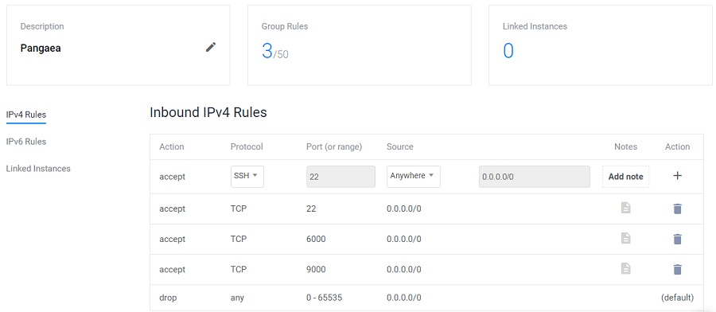
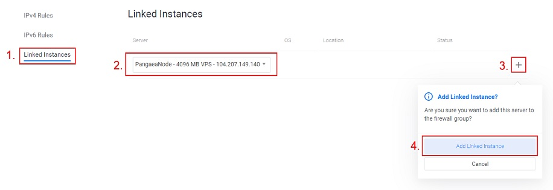
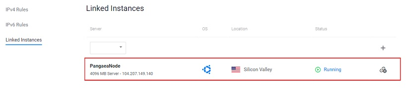

# Vultr

To launch your Vultr instance, we will go through 3 steps.

**Step 1: Launching Your Vultr Node**

* Registering Vultr and choosing the correct instance.

**Step 2: Connecting to Your Vultr Node**

* Connecting to your Vultr instance.

Huge thank you to Ionut from Chainode Capital for his original guide.

## **Step 1: Launching Your Vultr Instance**

### Logging into Vultr

[Vultr Main Page](https://www.vultr.com/)  
If you don’t already have an Vultr account, register one by clicking on "Sign up".  
Otherwise, log into your Vultr Account by clicking on "Sign in".


### Create a new instance

Once logged in, you'll want to add a new instance.  
Depending on whether your account is new or not, you may or may not have a Products page.

* If you already have an instance, click the "+" button to deploy a new server. You can also use this [link](https://my.vultr.com/deploy/) to go to the deploy page.
* Otherwise, your Products page will be already link you to the Deploy page.


### Choose Instance Type

For Pangaea requirements, two instance types would fit: Cloud Compute and High Frequency.  
Cloud Compute is recommended for Pangaea.

* **Cloud Compute instances** also work properly with 2 CPUs, 4 GB RAM with 80 GB SSDs.
* **High Frequency Instances** were recently introduced by Vultr and offer latest generation high performance 3GHz+ CPUs and NVMe SSDs.


### Select Server Location and Server Type

You can choose your preferred location as well as server type.  
Ubuntu 16.04 x64 or Debian 10 x64 have been tested to work very well.


### Choose Server Size

Harmony recommends one of the two following:

**Cloud Compute**

* 2 CPU, 4 GB RAM, 80 GB SSD

**High Frequency**

* 2 CPU, 4 GB RAM, 128 GB NVMe SSD

For "Additional Features", none of the selections are necessary.


### Setting Server Name

You can now set the name of your server, e.g. PangaeaNode  
Then you should click "Deploy Now".


At this point you should be back on the Products page and your server should be installing.  
However, the setup isn't completely done, as you need to still create a firewall.


### Create Firewall Group

As we want to allow other nodes to connect to yours, we have to open the correct ports.  
Once you are on the [Firewall page](https://my.vultr.com/firewall/), click Add Firewall Group.


Enter a name for the firewall group, e.g. PangaeaGame.


### Set Firewall Rules

#### Open the following 3 ports to the public \("Anywhere" on inbound\).

* TCP 22 \(SSH\)
* TCP 6000
* TCP 9000

Make sure to check that 3 Group Rules have been set.



#### Then link the instance to the firewall group. The steps are as follows:

1. Click Linked Instances.
2. Make sure your new server is selected.
3. Click the + button.
4. Click Add Linked Instance.



Your instance should now be added to the firewall group and the number of linked instances should increment by 1.



You can now go back to the Products page and your server is now successfully set up!


## **Step 2: Connecting to Your Vultr Node**



**Connect to your Vultr Instance by using Git Bash.**

If you do not have gitbash installed. Please visit this [link to install](https://gitforwindows.org/). Everything can be default selection when you are installing.

In your Vultr instance console overview. You will see your instance information. To go into your instance from git bash. We will use the command:

```text
ssh root@<INSTANCEIPADDRESS>
```


It will the prompt you for a password. The password is unique to each instance. To find your password. Look at the Vultr Console website. There is a unique password that is associated with your instance. Copy and paste that in.


Before anything is recommended to update your system:

```text
apt update && apt upgrade
```

Now install the following packages that will be needed to run Harmony by typing:

```text
apt-get install dnsutils
apt-get install tmux
```

You will be asked to confirm if you would like to download and install these packages. Just press Y to confirm.

