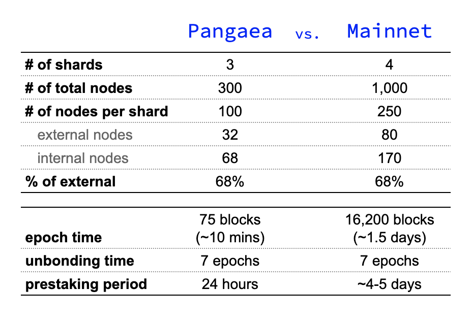

# Welcome to Open Staking with EPoS


## Congratulations, you made it to EPOS staking on Pangaea! <a id="new-local-account-creation"></a>

First, you need to create a new wallet so you can test the staking process on your own node.

When you have made yourself familiar with the process you can take your chances and participate in the staking games on the Pangaea network.

Let the games begin!

## How does staking the game work?

* Pangaea has total of 150 participants and 96 validator seats
* At every epoch, participants who wish to be validators should send a staking transaction
* Active nodes among the top 96 stakes will get a validator seat
* If a node isn't among the top 96 nodes, that node can choose to delegate its tokens to an active validator for that epoch
  * Note that there is an unbonding period of 7 epochs during which the staked tokens will not be usable \(even if a validator seat is not earned\)
* There are two main phases of this game:
  * **Pre-staking:**
    * Warm-up period which lasts 24 hours after network launch
    * Node launch and first staking transaction happen in this phase
    * No block rewards are earned during this period. In other words, your rank in starting pre-staking will not earn you additional rewards but being late might leave you out of the game or missing rewards
    * During this period, we will distribute an initial stake of 100,000 ONEs per player
  * **Staking:**
    * This is the main competition period, it will last 13 days
    * At every epoch \(every ~10 mins\), a node can select one of the actions below:
      * Restake earned block rewards \(note that block rewards are not auto-restaked\)
      * Raise delegation to increase stake
      * Delegate earned block rewards and/or initial stake \(if node has lower chance to be top 96 staker\)
      * Pool with other users offline to increase your chances as validator
      * Do nothing - In this case, the node's previous stake or delegation will continue to be valid



## How are actual rewards calculated?

Simple! Your actual rewards from this game will be a function of ending balance.

Initial reward pool for this game is 1.2 Million ONE tokens \(~$7,000\). Therefore, each player's reward will be calculated as:

```text
Reward(i) = 1,200,000 * Ending_balance(i)/Sum_of_all_ending_balances
```

* Validator and delegator rewards will be calculated with the same formula.
* Sum\_of\_all\_ending\_balances is the summation of all players' \(150\) ending wallet balances

